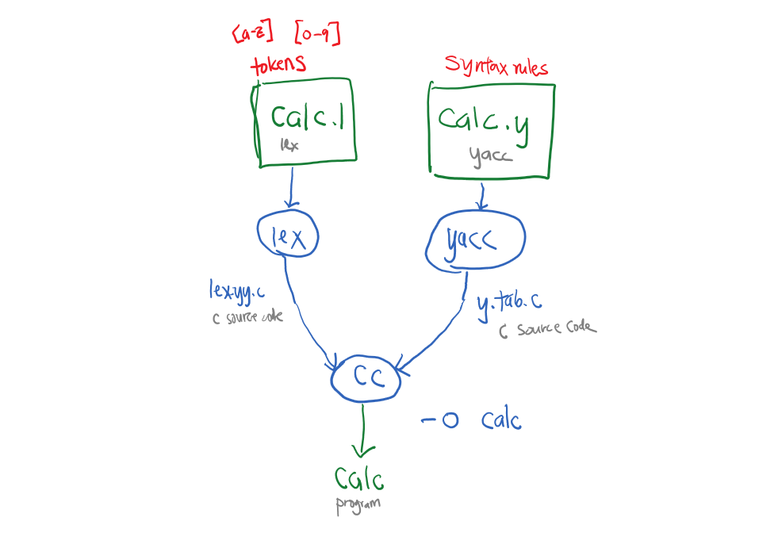

# README

[Video demonstrations](https://youtube.com/playlist?list=PL8HPPNCXDcvzDJqu1c8Z86qMZRym3exmm)

## Steps
	
1. Process yacc grammar file, use -d flag to define tokens
  This will create y.tab.c and y.tab.h files

  `yacc -d calc.y`
	
2. Process the lex specification file, this will create a lex.yy.c file
  
  `lex calc.l`

3. Compile and link the two C source code files, output name using -o flag; name it calc 
  this command will create y.tab.o, lex.yy.o, calc

  `cc y.tab.c lex.yy.c -o calc`

  * `y.tab.o` is the object file for the y.tab.c source
  * `lex.yy.o` is the object file for the lex.yy.c source

4. Run calc program
  
  `./calc`
